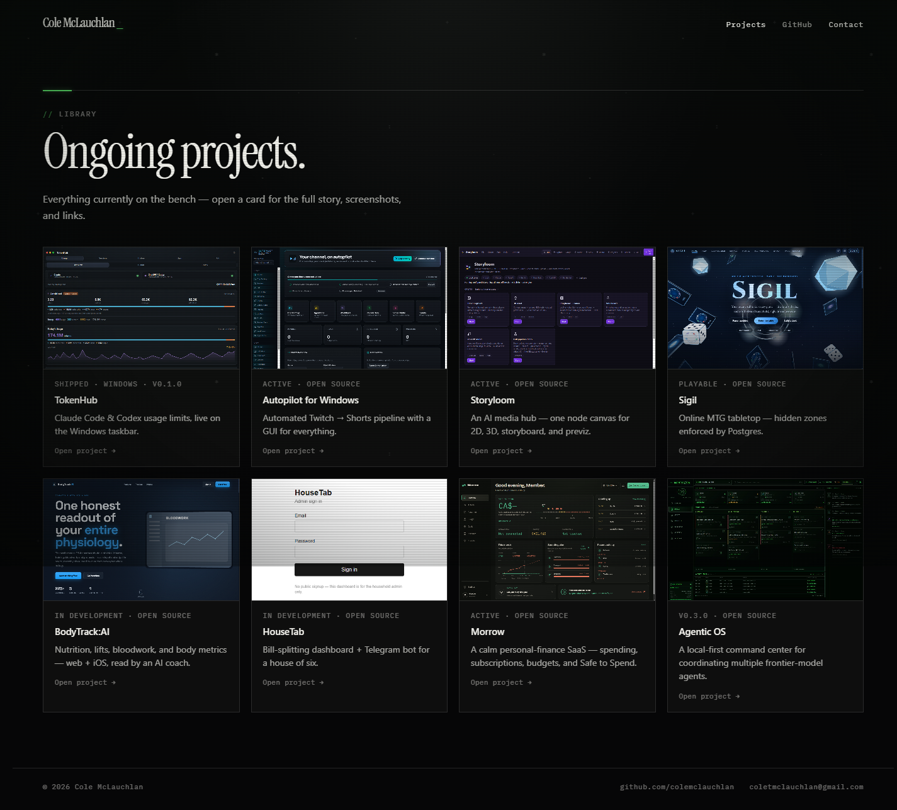

# cole-portfolio

Personal portfolio — a static site with a CRT-terminal aesthetic covering everything currently on the bench: TokenHub, Autopilot, Storyloom, Sigil, BodyTrack:AI, HouseTab, Morrow, and Agentic OS.

**Live:** https://colemclauchlan.com



Plain HTML/CSS/JS — no framework, no build step. An animated ASCII sky, a spinning ASCII donut, and per-project dialogs with screenshots and source links.

```bash
npx serve .   # local preview
```
